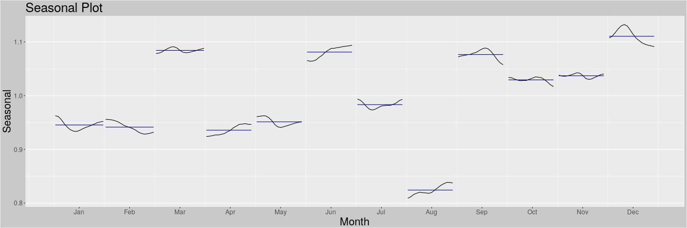
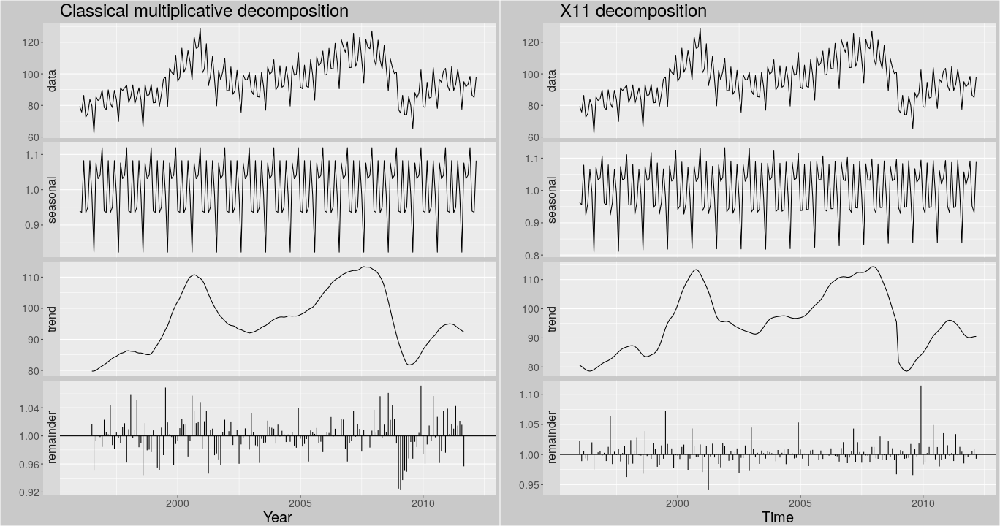
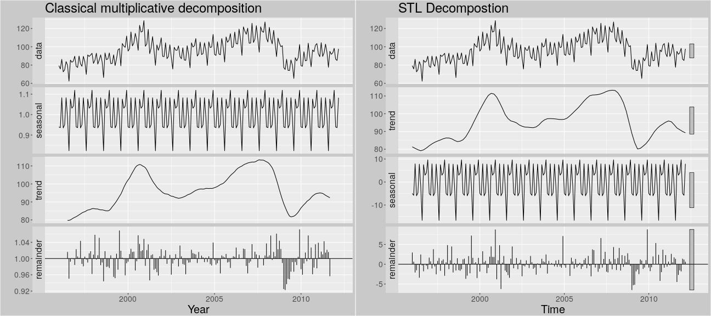
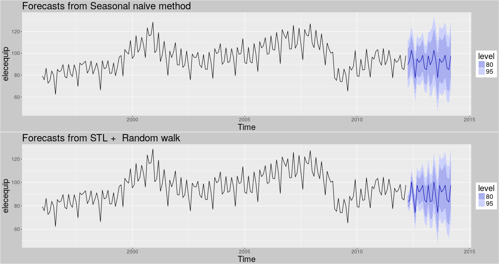
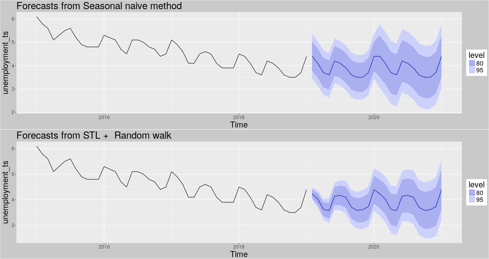
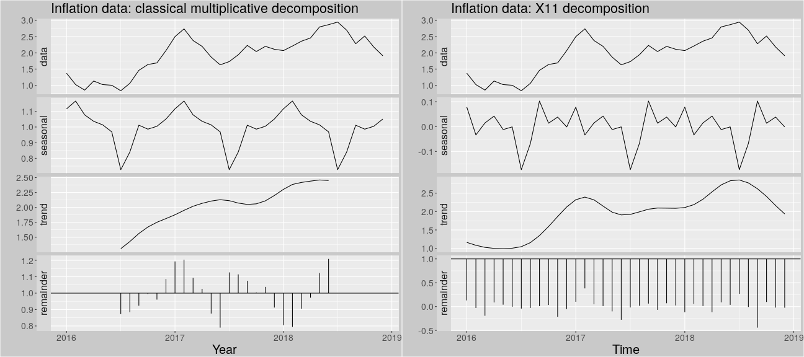

DATA 624 - Forecasting: Principles and Practice - Chapter 6
========================================================
author: John Grando & Alex Low
date: 2/5/19
autosize: true

  
Time Series Decomposition

Overview - Time Series Decomposition
========================================================

Decomposition of data into separate parts
<table>
<tr>
<td style="vertical-align:middle;" width=25%>
<ul>
<li>Trend-cycle (Trend)</li>
<li>Seasonality</li>
<li>Remainder</li>
</ul>
</td>
<td style="vertical-align:middle;">

</td>
</tr>
</table>

Formulaic Representation
========================================================
 
- Additive
  - $y_{t} = S_{t} + T_{t} + R{t}$
- Multiplicative
  - $y_{t} = S_{t} \times T_{t} \times R{t}$
  - $y_{t} = \log{S_{t}} + \log{T_{t}} + \log{R{t}}$

Moving Averages (MA)
========================================================

MAs are used to estimate trend-cycles and are simply an average value over a set time period

<table>
<tr>
<td>

</td>
</tr>
</table>

Moving Averages of Moving Averages (MA #x#)
========================================================

Moving Averages of Moving Averages can even be taken to further smooth the trend.  Note, the first MA has been downshifted to a value of 4 (usually m=12 for monthly data) to show a noticable difference between curves.

<table>
<tr>
<td>

</td>
</tr>
</table>

Seasonal Components
========================================================

Seasonal components can be calculated by averaging the detrended values for that season. For example, with monthly data, the seasonal component for March is the average of all the detrended March values in the data. These seasonal component values are then adjusted to ensure that they add to zero for additive models, and to approximately to `m` for multiplicative models

Classical Decomposition
========================================================

<table>
<tr>
<th>Additive</th>
<th>Multiplicative</th>
</tr>
<tr>
<td>
  <ol>
    <li>Compute Trend Cycle using MA (even m: 2xm, odd m:m) where m is the seasonal period  $\hat{T_{t}}$</li>
    <li>Calculate detrended series by subtraction  $y_{t}-\hat{T_{t}}$</li>
    <li>Estimate seasonal component  $\hat{S_{t}}$</li>
    <li>Calculate remainder by subracting all the above from the data  $\hat{R_{t}} = y_{t}-\hat{T_{t}}-\hat{S_{t}}$</li>
  </ol>
</td>
<td>
  <ol>
    <li>Compute Trend Cycle using MA (even m: 2xm, odd m:m) where m is the seasonal period  $\hat{T_{t}}$</li>
    <li>Calculate detrended series by division  $\frac{y_{t}}{\hat{T_{t}}}$</li>
    <li>Estimate seasonal component  $\hat{S_{t}}$</li>
    <li>Calculate remainder by dividing the calculated trends from the data  $R_{t} = \frac{y_{t}}{\left( \hat{T_{t}}\hat{S_{t}} \right)}$</li>
  </ol>
</td>
</tr>
</table>

Limitations of Classical Decomposition Method
========================================================

<table>
<tr>
<td>

  
  <ol>
    <li>Data Gaps at Beginning/End of Time Series </li>
    <li>Over-Smoothing of Rapid Changes</li>
    <li>Assumes Same Seasonal Changes Over Time</li>
    <li>Does Not Adapt to Unusual Values</li>
  </ol>
</td>
</tr>
</table>

X11
========================================================

Similar to classical decomposition; however, has many additional steps to account for drawbacks using the classical method.

SEATS
========================================================

<strong>S</strong>easonal <strong>E</strong>xtraction in <strong>A</strong>RIMA <strong>T</strong>ime <strong>S</strong>eries.  Only works with quarterly and monthly data, and details of methodology beyond the scope of this book.

STL
========================================================

<strong>S</strong>easonal and <strong>T</strong>rend decomposition using <strong>L</strong>oess.  Has many advantages over other methods which inludes; handling any type of seasonality, changing seasonality over time, trend smoothness control, and robust to outliers.  However, it has some disadvantages; only additive decomposition, difficulty with calendar variations.

Forecasting
========================================================

Forecasts can be easily made using the decomposed components which can be rewritten as follows: 

<table>
<tr>
<th>Additive</th>
<th>Multiplicative</th>
</tr>
<tr>
<td>
  $y_{t}=\hat{S_{t}} + \hat{A_{t}}$ 
  $\hat{A_{t}}=\hat{T_{t}} + \hat{R_{t}}$
</td>
<td>
  $y_{t}=\hat{S_{t}} \times \hat{A_{t}}$ 
  $\hat{A_{t}}=\hat{T_{t}} \times \hat{R_{t}}$
</td>
</tr>
</table>

Then, the seasonal component and seasonally adjusted component can be forecast separately.  Note, It is usually assumed that the seasonal component is unchanging, or changing extremely slowly, so it is forecast by simply taking the last year of the estimated component. 

Forecasting
========================================================

Case Study: U.S. Unemployment Figures
========================================================

The Bureau of Labor Statistics uses seasonal adjustment when it publishes unemployment figures. It adjusts the data using the SEATS method. Below we show the decomposition of the raw data using the traditional (multiplicative method) and SEATS method.

<table>
<tr>
<td>

</td>
</tr>
</table>

U.S. Unemployment Forecast
========================================================

Case Study: U.S. Inflation Figures
========================================================

Inflation data, based on the Consumer Price Index, is another data point that changes by season. Again it adjusts the data using the SEATS method but instead we look below at the X11 method as an example.

<table>
<tr>
<td>

</td>
</tr>
</table>

U.S. Inflation Forecast
========================================================

